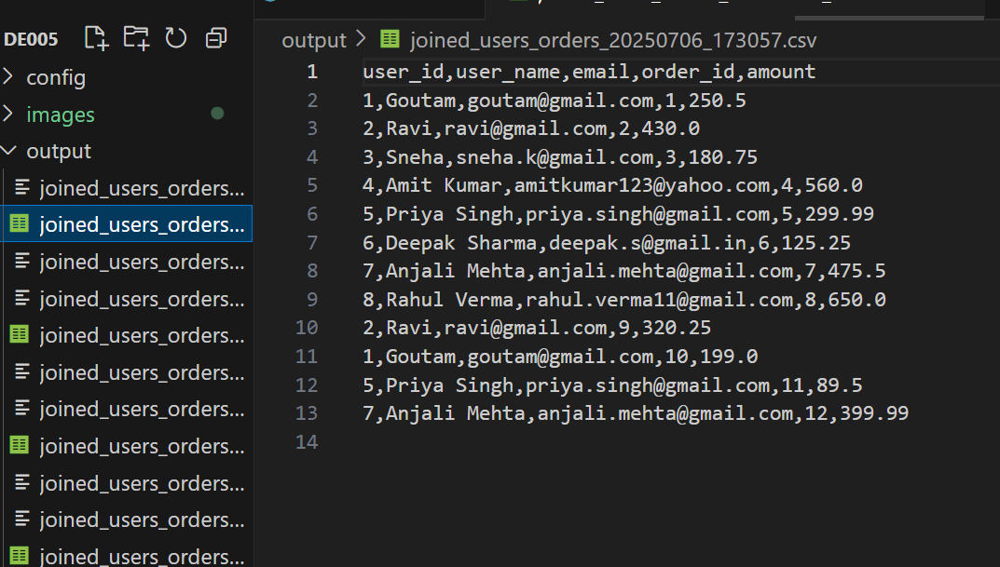
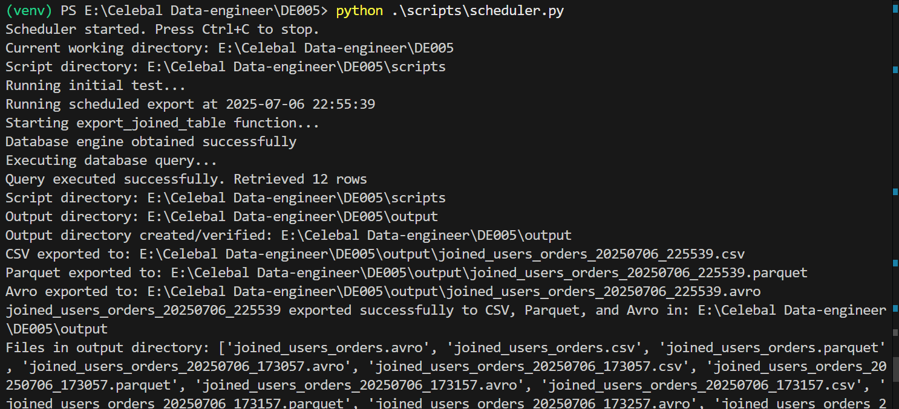
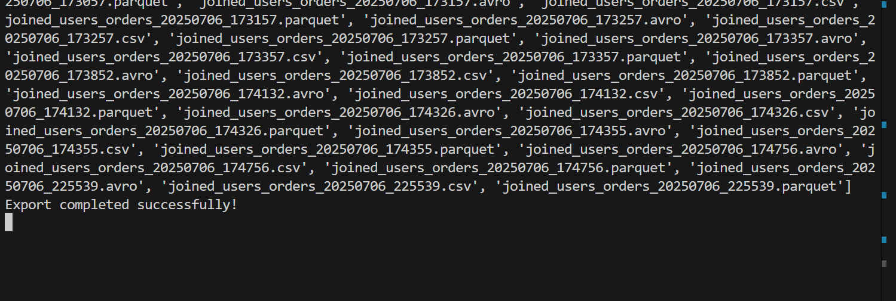
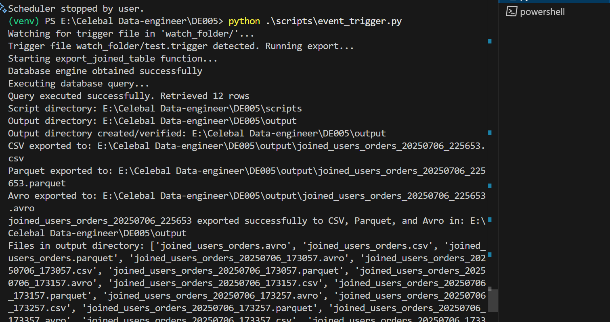
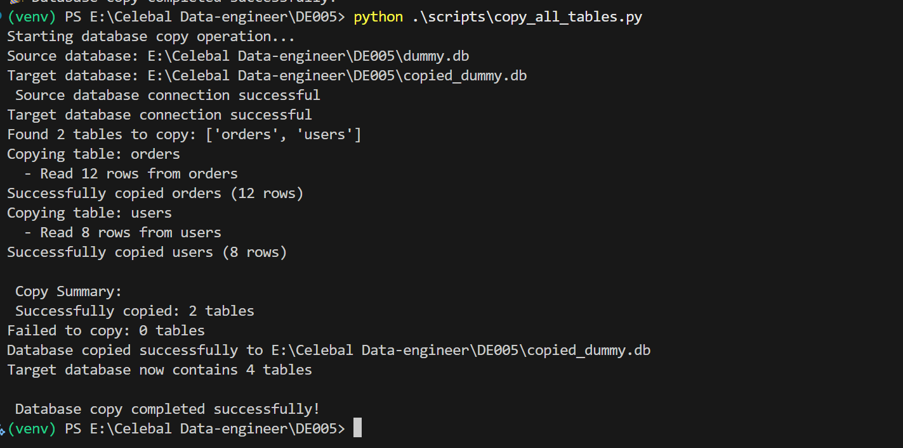
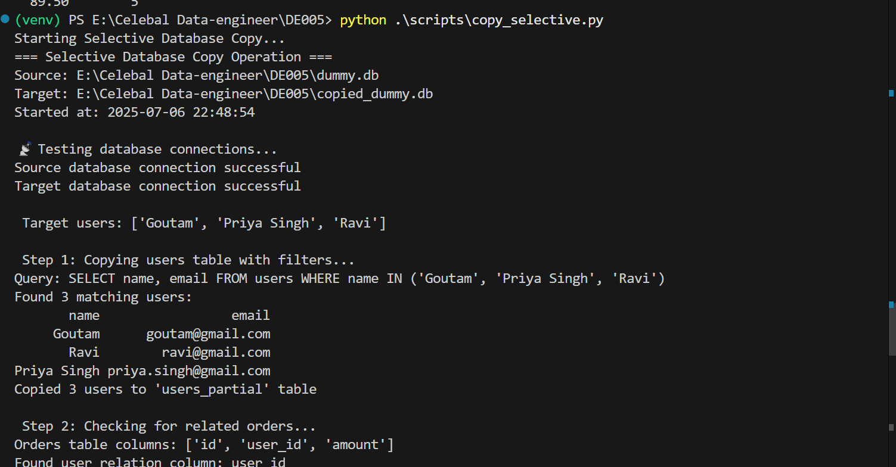
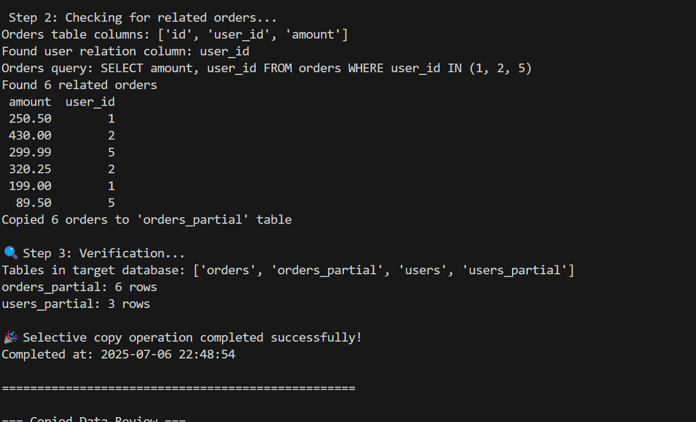
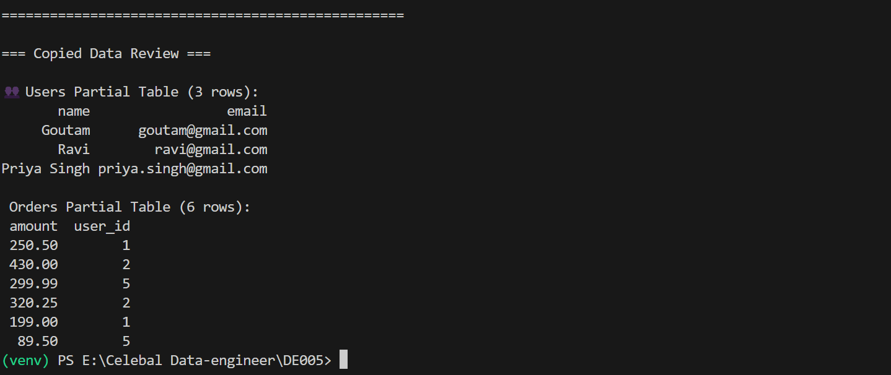

# week 5 assignment 
### Data Engineering assignement

## Setup Instructions

1. **Create a virtual environment (recommended):**

   On Windows:
   ```bash
   python -m venv venv
   venv\Scripts\activate
   ```
   On Mac/Linux:
   ```bash
   python3 -m venv venv
   source venv/bin/activate
   ```

2. **Install dependencies:**
   ```bash
   pip install -r requirements.txt
   ```

3. **Run scripts:**
   Navigate to the `scripts/` directory and run the desired Python script, for example:
   ```bash
   python scripts/export_data.py
   ```

## 📁 Project Structure

<pre>
📁 data_engineering_assignment/
├── config/
│   └── db_config.py             # SQLite connection configuration
│
├── scripts/
│   ├── create_dummy_db.py       # Creates SQLite DB with dummy users and orders data
│   ├── export_data.py           # Exports tables to CSV, Parquet, and Avro
│   ├── copy_all_tables.py       # Replicates all tables from source to target DB
│   ├── copy_selective.py        # Copies selective tables/columns
│   ├── scheduler.py             # Automates export using scheduled time
│   └── event_trigger.py         # Triggers export when a file appears in a watch folder
│
├── output/                      # Stores exported CSV, Parquet, and Avro files
├── watch_folder/                # Monitored for trigger files
└── README.md                    # Project overview and usage instructions
</pre>

---

## Task 1 
 Below are the results for Task 1:

 Copy Data from Database to CSV, Parquet, and Avro File Formats:

 


## Task 2 result

Below are the results for Task 2 scheduling and event Trigger:

Configure Schedule Trigger and Event Triggers to Automate the Pipeline Process
# scheduling


*Figure 1: Schedule 1 Output*


*Figure 2: Schedule 2 Output*

# Event Trigger :Event-Based Trigger (File Arrival)


This script watches the `watch_folder/` directory for a new file (with `.trigger` extension) and automatically runs the export when the file appears.

#### Run the Event Trigger Script
```bash
python scripts/event_trigger.py
```

**Trigger File Creation to Start Export**

On Linux or macOS:
```bash
touch watch_folder/my_file.trigger
```

 On Windows (Command Prompt):
```cmd
type nul > watch_folder\my_file.trigger
```
OR

 On Windows (PowerShell):
```powershell
New-Item -Path watch_folder\my_file.trigger -ItemType File
```



*Figure 1: Event Trigger 1 Output*


*Figure 2: Event Trigger  2 Output*

 

## Task 3: Copy All Tables from One Database to Another



*Figure 1: copy all tables 1 Output*


## Task 4: Copy Selective Tables with Selective Columns from One Database to Another

*Figure 1:  copy selective  Output*

*Figure 2: copy selective  Output*

*Figure 3: copy selective  Output*


## 🧾 Output Sample
Generated files will be saved inside the output/ folder:


👤 Author

Goutam Kumar Sah

